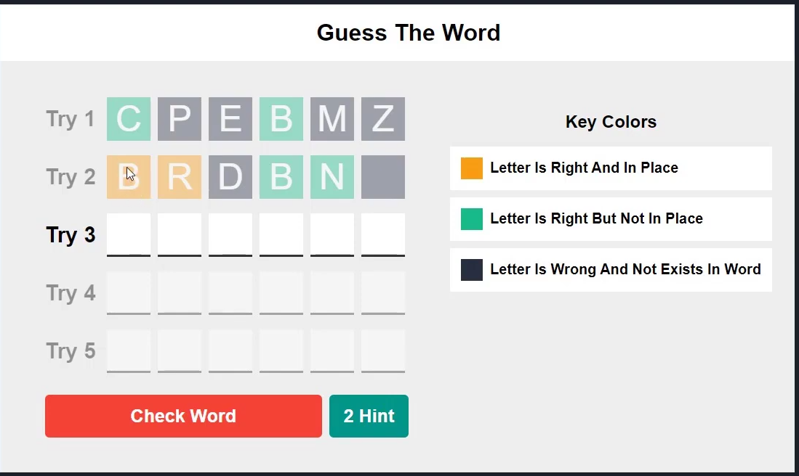

# guess-word-game
A fully responsive Word Guessing Game built with Vanilla JavaScript, HTML5, and CSS3. Features include hints, attempt management, and mobile-friendly UI.

## Live Demo
Check out the live game here: [Guess The Words Game](https://guess-word-game-seven.vercel.app/)
Key Features:

Responsive Design (Desktop & Mobile).

Interactive Hints system.

Keyboard navigation (Arrows & Backspace).

Technologies Used:

HTML5 / CSS3 (Flexbox & Media Queries).

Vanilla JavaScript (DOM Manipulation).

